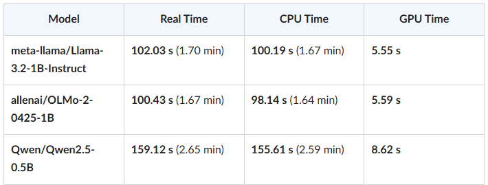
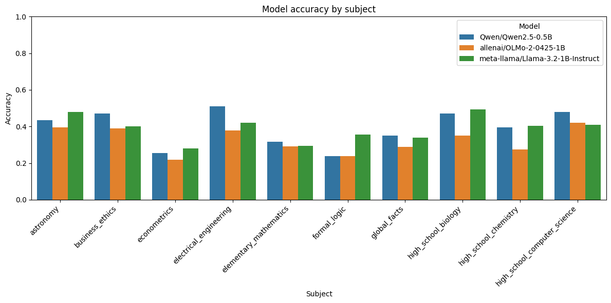
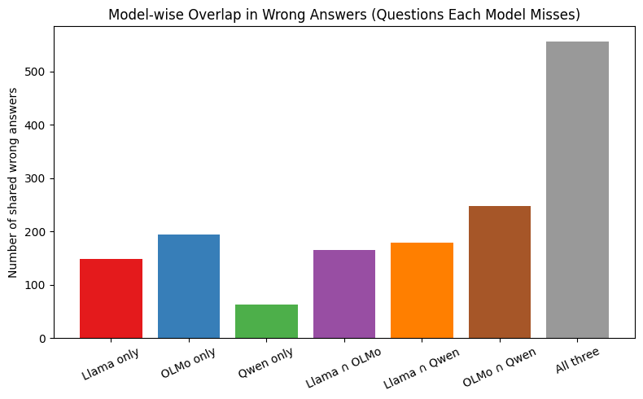
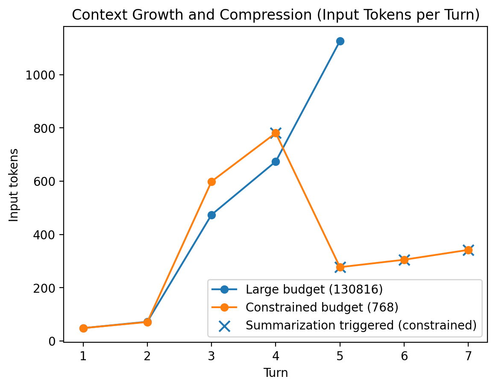
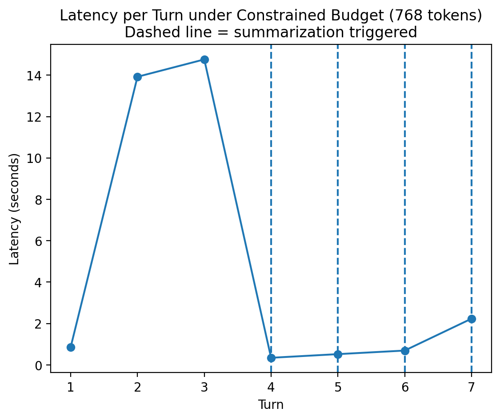

# 📘 LLM Evaluation and Chat Agent Implementation

------------------------------------------------------------------------
# ⚙️ Task 1---3 : Done
# 🔧 Environment Setup

Installed required modules:

``` bash
pip install transformers torch datasets accelerate tqdm huggingface_hub bitsandbytes
```

Hugging Face authorization was configured for **Llama 3.2-1B**.

Verification performed using:

    llama_mmlu_eval.py

------------------------------------------------------------------------

# ⚙️ Task 4 --- Timing Comparison

The model was evaluated under multiple hardware and quantization
configurations.

## ⏱ Timing Results

| Configuration | Real Time | User Time | System Time |
|---------------|-----------|-----------|-------------|
| GPU (No Quantization) | 22.699s | 24.2s | 9.016s |
| GPU (4-bit) | 33.7s | 22.5s | 6.54s |
| GPU (8-bit) | 44.8s | 42.4s | 9s |
| CPU (No Quantization) | 1m 59s | 13m 55.6s | 18.1s |
| CPU (4-bit) | 33.4s | 22.8s | 6.843s |


### Observations

-   GPU significantly outperforms CPU.
-   4-bit quantization provides better runtime efficiency compared to
    FP32.
-   CPU without quantization is substantially slower.
-   Quantization improves memory usage and moderately improves runtime.

------------------------------------------------------------------------

# 📚 Task 5 & 6 --- Multi-Model Evaluation (10 Subjects)

Models evaluated:

-   meta-llama/Llama-3.2-1B-Instruct
-   allenai/OLMo-2-0425-1B
-   Qwen/Qwen2.5-0.5B

⏱ Model Timing Comparison

The following table summarizes inference timing across the three evaluated models during Task 5.



- Llama and OLMo exhibit nearly identical runtime performance.
- Qwen requires noticeably longer total execution time.
- GPU compute time is relatively small compared to total runtime, indicating that data loading, tokenization, and CPU preprocessing dominate overall latency.
- Smaller parameter size does not necessarily guarantee faster end-to-end evaluation.


## 📊 Accuracy by Subject



### Observations

-   All models struggle in:
    -   Econometrics
    -   Elementary Mathematics
    -   Formal Logic
-   Performance differences are consistent across subjects.

------------------------------------------------------------------------

## ❌ Overlap in Wrong Answers



### Overlap Details

    Llama only     : 149
    OLMo only      : 194
    Qwen only      : 62
    Llama ∩ OLMo   : 165
    Llama ∩ Qwen   : 179
    OLMo ∩ Qwen    : 248
    All three      : 557

### Analysis

-   557 questions were missed by all three models.
-   Errors are not random.
-   Shared failures indicate systematic reasoning limitations.
-   Mistakes are subject-dependent rather than isolated.

------------------------------------------------------------------------

# 🤖 Task 8 --- Chat Agent with Hierarchical Context Management

The custom chat agent includes:

-   Manual chat loop
-   Prompt switching
-   Hierarchical summarization
-   Metrics logging
-   Latency tracking
-   History ON/OFF toggle

------------------------------------------------------------------------

# 🧠 Context Management Evaluation

Two token budget settings were tested:

-   Large budget: 130,816 tokens
-   Constrained budget: 768 tokens

## 📈 Context Growth and Compression



### Results

-   Large budget: input tokens increased from 48 → 1127 with no
    summarization triggered.
-   Constrained budget:
    -   Overflow at 781 tokens (Turn 4)
    -   L2 summary generated (191 tokens)
    -   Input tokens reduced to 277
    -   Subsequent turns stabilized between 277--342 tokens

This confirms effective multi-level compression.

------------------------------------------------------------------------

## ⏱ Latency Analysis



### Results

-   Large budget: latency scaled primarily with output length.
-   Constrained budget: latency stabilized after summarization reduced
    context size.
-   History OFF mode:
    -   Input tokens remained \~50 tokens per turn.
    -   Latency depended solely on output length.
    -   Conversational memory was eliminated.

------------------------------------------------------------------------

# 📌 Final Conclusions

### Hardware & Quantization

-   GPU is critical for efficient inference.
-   4-bit quantization provides strong efficiency gains.
-   CPU-only inference is significantly slower without quantization.

### Model Error Behavior

-   Mistakes are structured and correlated across models.
-   Difficult subjects consistently challenge small LLMs.
-   Failures are systematic rather than random.

### Chat Agent

-   Hierarchical summarization prevents context overflow.
-   Token growth is bounded under constrained budgets.
-   Latency stabilizes after compression.
-   History-disabled mode improves speed but sacrifices memory.

------------------------------------------------------------------------

# 🏁 Summary

This project demonstrates:

-   Performance trade-offs across hardware and quantization settings
-   Structured weaknesses in small language models
-   Systematic error overlap across models
-   Effective hierarchical context compression
-   Stable latency under bounded context growth


-------------------------------------------------------------------------

## Acknowledgment

Portions of this report were formatted and edited with assistance from ChatGPT (OpenAI) for clarity and presentation. All experimental design, implementation, and analysis were conducted by the author.
