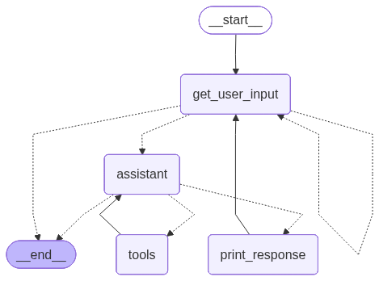

# ⏱ Task 1 — Sequential vs Parallel Execution

All timings were measured using `time` in Git Bash (Windows, RTX 3060 GPU).

---

## 🔹 Hugging Face Models
### Sequential

```bash
time bash -c 'python "Topic 3/program1.py"; python "Topic 3/program2.py"'
```
```
real    0m11.439s
```

### Parallel

```bash
time { python "Topic 3/program1.py" & python "Topic 3/program2.py" & wait; }
```
```
real    0m6.097s
```

---

## 🦙 Using Ollama

### Sequential

```bash
time bash -c 'python "Topic 3/program1_ollama.py"; python "Topic 3/program2_ollama.py"'
```

```
real    0m6.117s
```

### Parallel

```bash
time { python "Topic 3/program1_ollama.py" & python "Topic 3/program2_ollama.py" & wait; }
```

```
real    0m3.265s
```

---

## 📊 Summary

| Setup     | Sequential | Parallel |
| --------- | ---------- | -------- |
| HF Models | 11.439s    | 6.097s   |
| Ollama    | 6.117s     | 3.265s   |

---
## 🔎 Key Findings
* Parallel execution nearly halves runtime.
* Ollama significantly reduces execution time compared to direct HF loading.
* Fastest configuration: **Ollama (Parallel) — 3.265s**.
---

# ⏱ Task 2 
---
## Subsection 1, 2, and 3 done. 
---

# ⏱ Task 3
---
* Tool-Based LLM Agent: Implemented OpenAI function-calling to dynamically retrieve city coordinates (get_coords) and compute distances (calculate_distance), ensuring the model uses real data instead of fabricating values.
* Multi-Step Tool Orchestration: Designed an iterative reasoning loop that allows the agent to sequentially call multiple tools (coordinate lookup → Haversine calculation → final response) before producing an answer.
* I-64 Geospatial Distance System: Integrated a predefined I-64 route dataset with the Haversine formula to accurately compute distances between cities and gracefully handle invalid or out-of-route queries.
---

---
# ⏱ Task 4
---

This project demonstrates a modular LangGraph agent capable of coordinated multi-tool reasoning. The system integrates deterministic tools (letter counting, trigonometric computation, distance calculation) with LLM-based decision-making. The LLM dynamically selects which tools to call based on the user query.

A key observation is the behavior of the LangGraph outer loop (assistant → tools → assistant). When sequential chaining is enforced (one tool per step), complex queries may exceed the configured recursion_limit, triggering a GraphRecursionError. This is expected behavior and confirms that the agent is performing multi-step reasoning rather than compressing all tool calls into a single turn. 

---
# Task 5
---
I rewrote the program to run as a single continuous conversation (persistent chat history) rather than restarting state on each call. Instead of using a Python while loop for turn-taking, the conversation flow is implemented using LangGraph nodes and edges (e.g., get_user_input → assistant → tools → assistant → print_response → get_user_input). The agent supports tool use during the conversation via conditional routing to a ToolNode, and includes SQLite checkpointing for crash recovery. When restarted with the same thread_id, the system resumes from the last saved node/state and continues the conversation without losing context.

This portfolio includes:

- A Mermaid diagram showing the graph structure 

- Example conversations demonstrating tool calls, context carry-over across turns, and recovery after restart (resume using the same thread_id).

---
# ⏱ Task 6:
---
There is a clear opportunity to parallelize independent tool calls that do not depend on each other’s outputs. For example, when answering queries that require counting multiple letters in the same string (e.g., count 'i' and count 's' in “Mississippi riverboats”), the two count_letter_tool calls can be executed concurrently because they read the same input and have no dependency. Similarly, coordinate lookups for two cities (via get_coords_tool) can be performed in parallel before computing a distance.

In the current agent, these calls are often executed sequentially across the outer loop (assistant → tools → assistant), especially when “one tool per step” is enabled. A parallel dispatch pattern (e.g., batching multiple tool calls in one assistant turn or using a ToolNode-style parallel execution approach) would reduce outer-loop turns, avoid hitting recursion limits for multi-step queries, and improve latency.