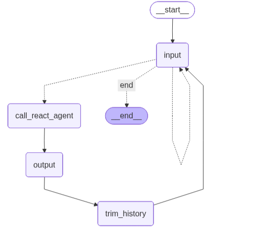
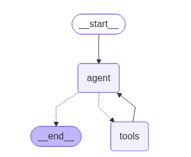
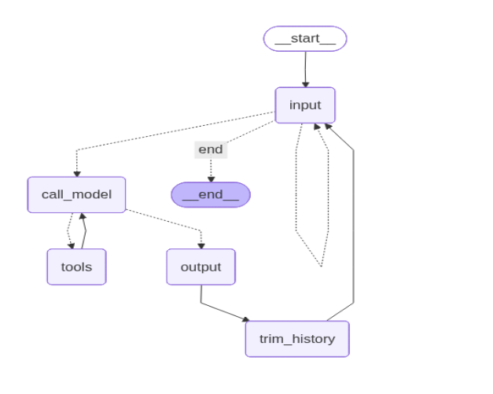

# Task 3

## 1. ToolNode Parallel Dispatch

**What features of Python does ToolNode use?**
ToolNode uses Python’s `async/await` and the event loop to run multiple tools concurrently. When multiple tools are requested, it starts them together (similar to `asyncio.gather`) and waits until all finish before continuing.

**What tools benefit most?**
Parallel dispatch works best for independent, mostly I/O-bound tasks such as:

* External API calls (weather, maps, web services)
* Search and retrieval (SQL queries, vector DB searches, web fetches)
* File and storage access
* Batch enrichment or lookup tasks

---

## 2. Handling Special Inputs ("verbose" and "exit")

In both programs, special inputs are handled **before** calling the LLM.

* **`verbose` / `quiet`**
  Updates a flag in the conversation state to turn debugging output on or off, then loops back for the next input. The LLM is not called.

* **`exit` / `quit`**
  Recognized as termination commands and routed directly to `END`, stopping the conversation.

These commands are treated as control inputs, not chat messages, and are not added to conversation history.

---

## 3. Graph Diagram Comparison

The main difference is the reasoning loop.

* **ToolNode:**
  Has a defined interaction between the LLM and tools. The model can request multiple tools in one step, and they are executed concurrently.

* **ReAct Agent:**
  Uses a continuous reasoning–action loop:

  ```
  Thought → Action → Observation → Thought
  ```

  The LLM calls one tool at a time, waits for the result, then reasons again. It is model-driven and sequential.




---

## 4. When ToolNode Is Preferable

ToolNode is preferable for **multi-tool planning**, where several independent tools must be called before the next reasoning step.

ReAct enforces a sequential loop (one tool at a time), while ToolNode allows multiple tools to be executed in parallel.

**Example:**
In a travel recommendation task, the agent may need weather, flight prices, hotel costs, and transit data for several cities. These queries are independent and can be executed in parallel using ToolNode, then combined in a single reasoning step—avoiding the step-by-step execution of a ReAct agent.

---
