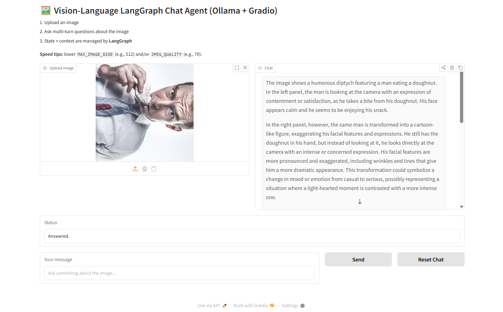

# VLL Chat Agent Dialogue

## 🖼 Example Interaction


### Conversation

**User:** Explain the image.
**Assistant:**
The image shows a humorous diptych featuring a man eating a doughnut. In the left panel, the man looks content while taking a bite. In the right panel, the same man appears in a cartoon-like exaggerated form with intensified facial features and expression. The contrast may represent a shift from a lighthearted moment to a more dramatic one.

---

**User:** Can you identify the type of rotation of this image?
**Assistant:**
The image appears to show multiple rotations of the same scene, each rotated approximately 90 degrees clockwise from the previous one.

---

**User:** Why are you saying there are multiple images?
**Assistant:**
I am a text-based AI model and do not have direct visual perception. My earlier response was based on interpretation from the prompt context. If the image is a single frame, then that interpretation may have been incorrect.

---

## 🖥 UI Implementation

I attempted to structure the interface so that each user query appears clearly before the assistant’s response. Due to time constraints, the alignment is slightly imperfect in the final version.

Below is the UI created for the conversation:



---

# Exercise 2: Person Entry–Exit Detection

## 🎯 Objective

Detect when a person enters and exits the video frames using LLaVA via Ollama and generate time-based segments.

---

## ⚠️ Issue Identified

The initial implementation detected only **one** enter–exit event.
However, manual inspection of the frames revealed **two distinct person-presence events**.

To verify this, I used **Exercise 1** and directly queried the model with the corresponding frames. The model correctly identified a person when prompted individually, confirming that the event was being missed during sequential processing.

---

## 🔧 Improvements Implemented

### 1️⃣ Prompt Refinement

I refined the detection prompt to:

* Be more explicit
* Strictly enforce JSON-only output
* Remove ambiguity in instructions

This improved detection consistency and allowed both events to be correctly identified.

---

### 2️⃣ Temporal Stability Adjustment

I observed occasional single-frame false negatives (e.g., detection in frames 15 and 17 but not 16).
Because the original configuration used:

```
end_k = 1
```

a single missed detection immediately terminated the segment, fragmenting continuous person-presence intervals.

To improve robustness, I increased:

```
end_k = 2
```

This requires **two consecutive negative frames** before closing a segment, preventing brief detection flicker from splitting valid intervals.

---

## ✅ Result

After:

* Refining the prompt
* Increasing temporal tolerance (`end_k`)

Both enter–exit events were successfully detected, and segmentation became more stable and consistent.
